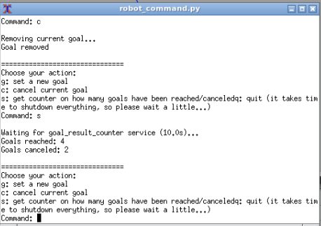

In this document the following arguments will be presented:
- [Introduction](#introduction)
- [Installation](#installation)
- [Use](#use)
- [Information console](#information-console)
- [Command console](#command-console)
    - [set a goal](#set-a-goal)
    - [cancel a goal](#cancel-a-goal)
    - [Get number of reached/canceled goals](#get-number-of-reachedcanceled-goals)
    - [Quit the simulation](#quit-the-simulation)
- [Node robot\_command.py](#node-robot_commandpy)
    - [Subscriber to /odom and publisher /robot\_info\_odom](#subscriber-to-odom-and-publisher-robot_info_odom)
    - [Server robot\_current\_goal\_pos](#server-robot_current_goal_pos)
    - [function goal\_management](#function-goal_management)
- [Improvements](#improvements)

A complete documentation for each node functions of the implemented package `rt1_ass2` can be found at <a href="https://davidecaligola.github.io/rt1_assignment2/" target="_blank">https://davidecaligola.github.io/rt1_assignment2/</a>.

# Introduction
In this repository, the [ROS](https://www.ros.org) package `rt1_ass2` has been implemented to satisfy the requirements of the second assignemnt of the course [Research Track 1](https://corsi.unige.it/en/off.f/2022/ins/60235?codcla=10635) of [Robotics Engineering](https://corsi.unige.it/en/corsi/10635) course by [University degli Studi di Genova](https://unige.it).  
The assignment is based on the ROS package [assagnemnt_2_2022](https://github.com/CarmineD8/assignment_2_2022) which implements, among other features, an action server to drive a robot with the [Bug 0 algorithm](https://www.cs.cmu.edu/~motionplanning/lecture/Chap2-Bug-Alg_howie.pdf) through a predefined environment. For convenience, such a package is included in this repository.  
The requirements for the assignment are the following:  
- Create a new package in which you will develop three nodes:  
  1. A node that implements an action client allowing the user to set a target (x,y) or to cancel it. The node also publishes the robot position and velocity as a custom message (x,y,vel_x,vel_y) by relying on the values published on the topic `/odom`
  2. A service node that, when called, prints the number of goals reached and canceled
  3. A node that subscribes to the robot's position and velocity (using the custom message) and prints the distance of the robot from the target and the robot's average speed. use a parameter to set how fast the node publishes the information.  
  
- Create a loaunch file to start the whole simulation. Set the value for the frequency with which node 3. publishes the information.  

The requirements have been fulfilled with the package `rt1_ass2`:  
1. node `robot_command.py`  
   In this node, a rough textual interface has been developed to interact with the action server through a respective action client. It allows to  
   - set a goal for the robot to reach
   - cancel the current goal
   - get the information about the number of goals reached or canceled
   - quit the simulation.  
  
   Furthermore, this node publishes the topic `/robot_info_odom` containing the planar position and linear velocity of the robot extracted by the topic `/odom`  
   For convenience, it also provides the service `robot_current_goal_pos` which provides the planar position coordinates (x,y) of the current goal.

2. node `robot_goal_result_count_srv.py`  
   It implements the service `goal_result_counter` which, subscribing to the topic `/reaching_goal/result`, provides the number of goal reached or canceled.  

3. node `robot_info_print.py`  
   It subscribes to the topic `/robot_info_odom` and the service `robot_current_goal_pos` to calculate the distance of the robot from the current goal and the average linear velocity.  
   The node prints such information on screen at frequency set by the parameter freq. Such a parameter can be specified in the launch file used to start the whole simulation or from command line (see [Use](#use))  
   
The whole simulation can be started using the `rt1_ass2.launch` file.  
The implementation of the node `robot_command.py` is better explained in the section [Command console](#command-console)

# Installation
Requirements:
- ROS environment is already installed and working properly,
- Git version control system properly installed,
- a proper Github SSH key setup (see [Adding a new SSH key to your GitHub account](https://docs.github.com/en/authentication/connecting-to-github-with-ssh/adding-a-new-ssh-key-to-your-github-account) for more information about it)  

The software has been tested in a machine with Linux Ubuntu 20.04 LTS.  
The package `rt1_ass2` makes use of the terminal [xterm](https://invisible-island.net/xterm/) to interact and to provide information via console.  
In Ubuntu, it is possible to install it using apt:  
```shell
sudo apt update && sudo apt -y install xterm
```
To use the packages in this repository, create a directory where a catkin workspace will be created for running the packages:
```
mkdir test_ws
```
Clone the repository in the test_ws/src folder:
```
git clone git@github.com:davideCaligola/rt1_assignment2.git test_ws/src
```
Navigate into the workspace folder and build the packages
```
cd test_ws
catkin_make
```
Setup the current workspace
```
source ./devel/setup.bash
```
Launch the simulation
```
roslaunch rt1_ass2 rt1_ass2.launch
```
See section [Use](#use) for more information on how to interact with it.

# Use
It is possible to launch the whole simulation using the provided launch file:
```shell
roslaunch rt1_ass2 rt1_ass2.launch
```
It is possible to set the frequency the node `robot_info_print.py` prints the required roboto information modifying the parameter freq in the rt1_ass2.launch file:
```xml
<arg name="freq" default="1.0" />
```
or from command line:
```shell
roslaunch rt1_ass2 rt1_ass2.launch freq:=2.0
```
The launch file will run the provided package `assignment_2_2022` opening rviz and gazebo environments.  
Furthermore, two xterm consoles will open: one for displaying the information about the linear distance between the robot and the current goal and the average linear velocity; the second one to interact with the action server.  

# Information console
Such a console shows the linear distance between the current goal and the robot and the robot's average linear velocity, as soon as the current goal status becomes *`ACTIVE`*.  
If a goal is not set, it hs been reached or canceled, the linear distance and the linear average velocity are both displayed as 0.
<style>
    p.centered {
        text-align: center
    }
</style>
<p class="centered">
    
</p>
<p class="centered">Robot info print console</p>

# Command console
This console is used to interact with the user.
<p class="centered">
    
</p>
<p class="centered">Command console</p>

### set a goal
Press `g` and Enter.  
It will be possible to digit the x and y coordinates as float number:
<p class="centered">
    
</p>
<p class="centered">Command console - g command</p>

To be noted that, to keep the robot within the environment, both x and y coordinates are bounded within the range [-8.0,8.0].  
Once sent the goal coordinates, the command console will be again available as soon as the action server goal status switches to `ACTIVE`.  
Setting a new goal while the robot has not reached the current goal yet, cancels the current goal and sets a new goal to reach.

### cancel a goal
Press `c` and Enter.  
The request to cancel the current goal is sent to the action server and the command console will be again available when the action server goal status switches to `PREEMPTED`.
<p class="centered">
    
</p>
<p class="centered">Command console - c command</p>

### Get number of reached/canceled goals
Press `s` and Enter.  
A client will send a request for such an information to the server `goal_result_counter` and it will print the received result.  
After that the command console is again available to enter a new command.
<p class="centered">
    
</p>
<p class="centered">Command console - s command</p>

### Quit the simulation
Press `q` and Enter.  
To close the whole simulation, the node `robot_command.py` has been set as `REQUIRED` in the launch file. Selecting the command `q` from the command console, it will shutdown the node `robot_command.py` and eventually all the processes related to the `rt1_ass2.launch` file, included rviz and gazebo enviroments.

# Node robot_command.py
This node is the core of the package. In this section a deeper view on the architecture used to implement it is presented.  
The main function initializes the node, it creates the publisher for the topic `/robot_info_odom`, the server for the service `robot_current_goal_pos` and the subscriber to the topic `/odom`.  
It also starts the thread for the function `goal_management`, which handles the command console.  
the following diagrams will show in better detail each created component.

### Subscriber to /odom and publisher /robot_info_odom
The publisher of topic `/robot_info_odom` is used in the callback for the topic `/odom`. Everytime that a message from `/odom` is received, a respective message on `/robot_info_odom` is published. Thus, topics `/robot_info_odom` and `/odom` have the same rate.  
The message of topic `/robot_info_odom` has the following format:
```
float64 x
float64 y
float64 vel_x
float64 vel_y
```
The following sequence diagram shows the operations of the subscriber and publisher.
<p class="centered">
    
</p>
<p class="centered">Sequence diagram for subscriber to topic /odom and publisher of topic /robot_info_odom</p>

### Server robot_current_goal_pos
The value of the current goal position is set by the `goal_management` function and it is shared within the node using a global variable.  
The current goal can assume two values:
- None, when there is not any active goal
- (x,y), coordinates, when there is an active goal
The server, besides the goal coordinates, sends the flag valid with value
- True, when there is an active goal
- False, when there is not any active goal
Thus, the server message has the following format:
```

---
bool valid
float64 x
float64 y
```
The following sequence diagram shows the server operations.
<p class="centered">
    
</p>
<p class="centered">Sequence diagram for server robot_current_goal_pos operations</p>

### function goal_management
This function manages the command console to interact with the user. In order to not block the node handling ther server service, subscriber and publisher, it runs in a separated thread.  
The main working principle of the command console is represented in the following state machine:
<p class="centered">
    
</p>
<p class="centered">State machine describing the management of the command console</p>

# Improvements
The package can be improved in several ways, among the others:
- Error handling  
  Some possible issue, such as wrong input on the command console, wiating servers and so on, have been taken care in a rough manner. It is possible to improve it, considering a deeper analysis and more careful implementation
- Stability  
  Sometimes some errors are reported, as the follow:
  <p class="centered">
    
  </p>
  <p class="centered">Example of sporadic errors that could occur</p>
  Usually they do not compromise the correct working process, but highlight a lack of synchronization, timing and error handling
- Timing  
  It take time to recover to command console after deleting a goal spcifying a new goal. It could be because it takes time to switch the goal status from `ACTIVE` , to `ABORTED` and back to `ACTIVE`, or because of the architecture of the node. Further investigation are needed.
- UI  
  A better UI could be developed to offer a better user experience
- Architecture  
  It is possible to implement the whole state machine in the node `robot_command.py` in object-oriented way. Depending on the used abstractation to represent the state machine, its states and transitions, adding and removing states/transitions could become easier, allowing to generalize the package application.
- Simulation shutdown  
  Currently, the shutdown is done with a workaround. A better and more gracefully shutdown should be implemented.


